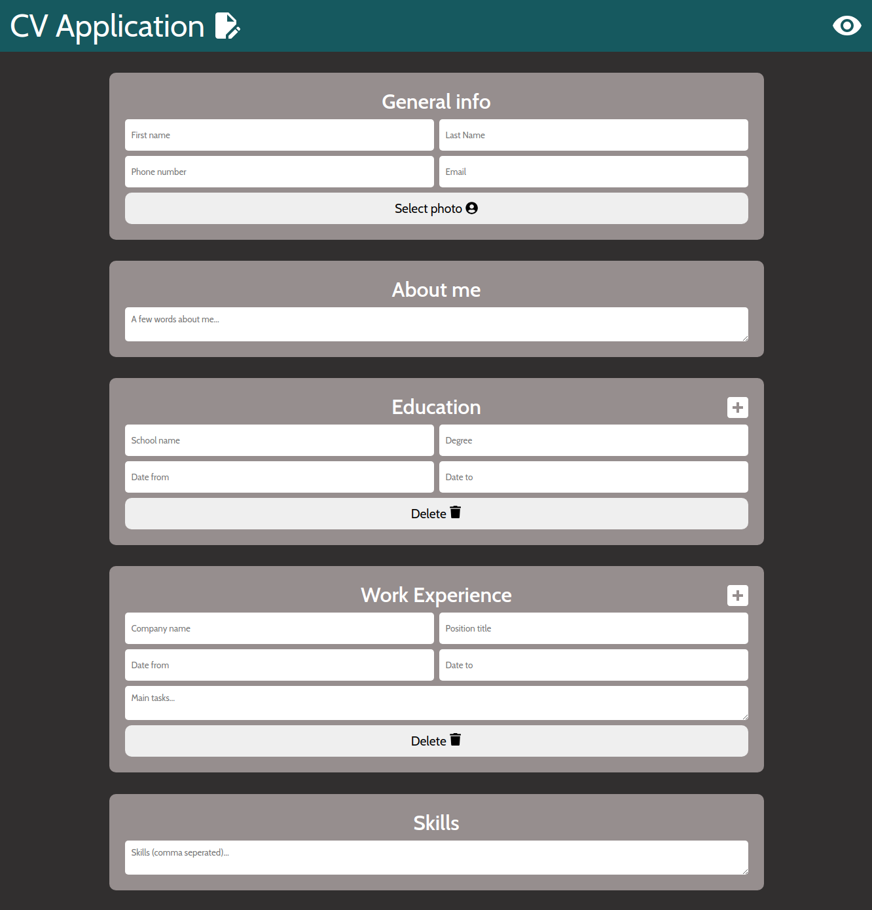
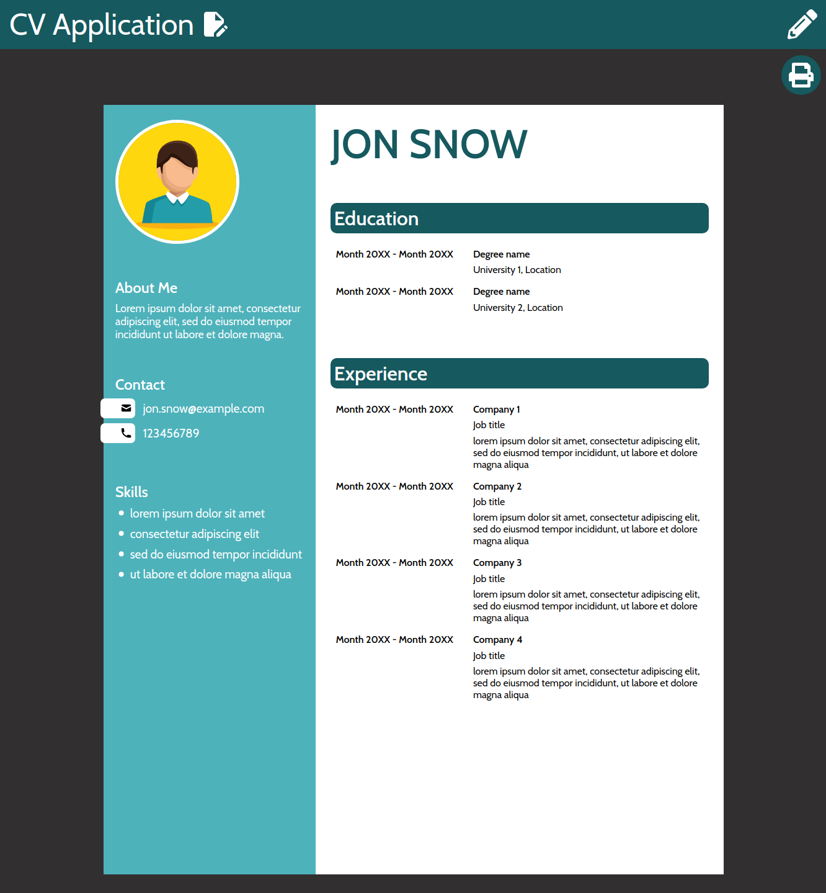
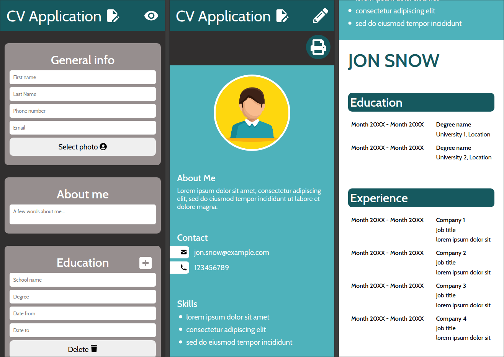

# The Odin Project #18: CV Application

The goal of this Odin Project assignment was to create a CV application.

I started and finished this project in June 2023.

## Assignment

[The Odin Project - React - #18 CV Application](https://www.theodinproject.com/lessons/node-path-react-new-cv-application)

## Technology

- React
- JavaScript
- Vite
- CSS

## Key Concepts

- State: useState, changing state, updating state objects and arrays
- Forms in React
- JSX
- Props & passing data between components
- Event listeners in React
- Conditional rendering

## Features

- Edit & Preview views.
- Ability to select a photo.
- Ability to print or save the resume. react-to-print library allows users to print out the contents of a component.

## Links

[Live Demo](https://brightneon7631.github.io/odin-cv-application/)

[My Other Projects](https://brightneon7631.github.io/odin-scrimba-projects/)

## Screenshots

### Desktop





### Mobile



## Sources

- Design inspired by: https://github.com/WeKiBan/CV_App
- <a href="https://www.freepik.com/free-vector/businessman-character-avatar-isolated_6769264.htm">Image by studiogstock</a> on Freepik
- https://fonts.google.com/specimen/Cabin

## Deployment

```bash
# clone repo
git clone

# install project dependencies
npm install

# run vite dev server
npm run dev

# create a production build
npm run build
```
